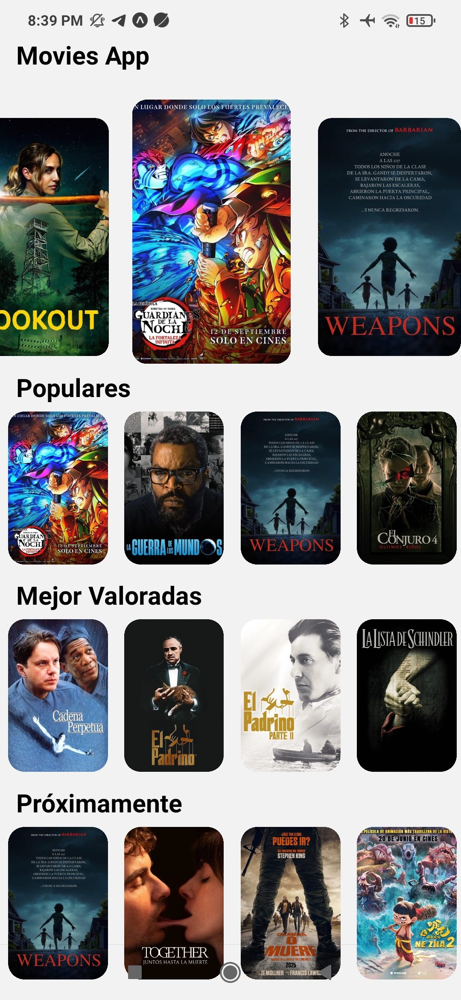

# 📱 Movies App  

> Aplicación móvil construida con [Expo](https://expo.dev) que permite a los usuarios consultar peliculas de la API [themoviedb](https://developer.themoviedb.org/)

---
## 🚀 Tecnologías usadas
- [React Native](https://reactnative.dev/)  
- [Expo](https://docs.expo.dev/)  
- [TypeScript](https://www.typescriptlang.org/)  
- [Nativewind](https://www.nativewind.dev/) 
- [Expo LinearGradient](https://docs.expo.dev/versions/latest/sdk/linear-gradient/) 
- [TanStack Query v5](https://tanstack.com/query/latest/docs/framework/react/overview)
- [Axios](https://www.npmjs.com/package/axios)
- [React Native Reanimated Carousel](https://rn-carousel.dev/)
---
## 📂 Estructura del proyecto  
```bash
├── assets/           # Imágenes, íconos, fuentes
├── presentation/     # Componentes reutilizables y Hooks
├── core/             # Acciones y API
├── config/           # Funciones auxiliares
├── app/              # Incluye todas las ventanas de la app
├── infrastructure/   # Interfaces y Mappers
└── package.json
```

## ⚙️ Instalación y ejecución  

1. Clona este repositorio
```bash
git clone https://github.com/teodoro-roag/Movies-RN-APP.git
cd Movies-RN-APP
```

2. Instala dependencias
```bash
npm install
```
3. Inicia el proyecto

```bash
npm run start
```
4. Escanea el QR con la app de [Expo Go](https://expo.dev/go) para probarlo en tu dispositivo.


## 🧩 Scripts disponibles  

- `npm run start` → Inicia el proyecto con Expo  
- `npm run android` → Corre en emulador/dispositivo Android  
- `npm run ios` → Corre en emulador iOS (solo en macOS)  
- `npm run web` → Corre en navegador  

## 📸 Capturas de pantalla  

| Inicio | Detalles | Más detalles |
|--------|--------|---------------|
|  |  |  |

## 🛠️ Contribución  

1. Haz un fork del proyecto  
2. Crea una rama para tu feature  
```bash
git checkout -b feature/nueva-feature
```
3. Haz commit de tus cambios
```bash
git commit -m 'Agrega nueva feature'
```
4. Haz push a la rama
```bash
git push origin feature/nueva-feature
```
5. Abre un Pull Request